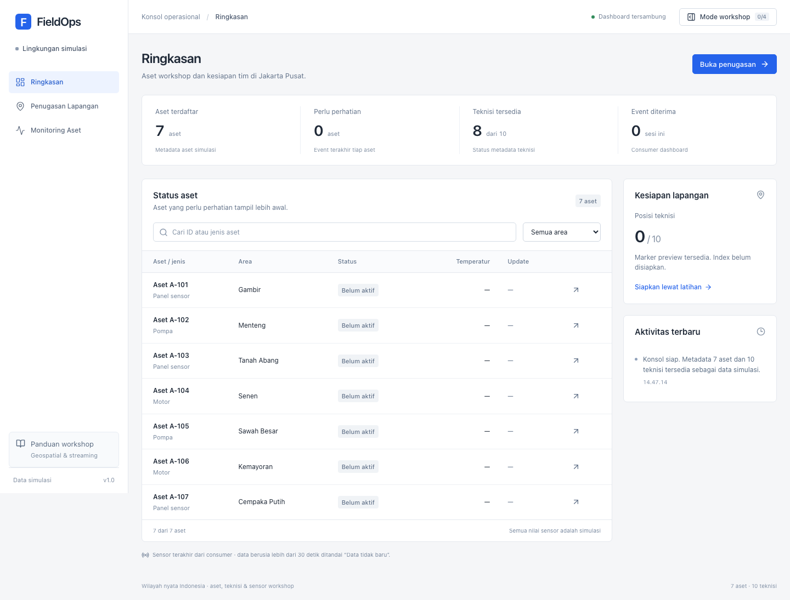

# FieldOps

Workshop Redis untuk penugasan teknisi dan monitoring aset. Durasi 60–90 menit; peserta mengisi empat fungsi pada dua file TypeScript. Peta dan contoh wilayah memakai lokasi nyata di Jakarta Pusat; aset, teknisi, dan sensor adalah data workshop.



Tampilan aktual: [penugasan](docs/assets/assignment-solution.png) · [monitoring](docs/assets/monitoring-solution.png) · [Mode workshop](docs/assets/workshop.png).

## Menjalankan

Prasyarat: Docker Compose ≥2.24.4, browser, dan editor kode.

```bash
cp .env.example .env
docker compose up -d --build
```

Buka **http://localhost:8088**. Pada workspace ini Docker berjalan di VM Lima milik user biasa. Bila `docker` belum ada di PATH, gunakan helper berikut tanpa mengganti user:

```bash
./scripts/workspace-compose.sh up -d --build
```

Helper juga menerima perintah `ps`, `logs`, `exec`, dan `down`. Perubahan frontend/Dockerfile membutuhkan build ulang; perubahan dua file latihan langsung dibaca watcher backend.

## Mulai workshop

| File peserta                  | Latihan               | Hasil                                             |
| ----------------------------- | --------------------- | ------------------------------------------------- |
| `apps/api/src/labs/geo.ts`    | GEO-01 · GEO-02       | Simpan posisi, lalu cari teknisi dalam radius     |
| `apps/api/src/labs/korvet.ts` | KORVET-01 · KORVET-02 | Kirim event ke Korvet, lalu konsumsi ke dashboard |

Buka **Mode workshop**, pilih latihan, dan ikuti petunjuk. Setelah menyimpan kode, tekan **Periksa latihan**. Starter memakai stub valid; fitur terbuka setelah fungsi lulus pemeriksaan terhadap Redis/Korvet nyata.

## Struktur project

```text
apps/api/src/        HTTP, infrastruktur, operasi, validator, dan dua file labs
apps/web/src/        Shell aplikasi, fitur per halaman, komponen bersama, styles
packages/contracts/ Tipe payload bersama; tanpa kode runtime
infra/              Dockerfile, nginx, dan override Compose
workshop/           Starter reset dan jawaban manual
scripts/            Helper Compose serta perintah pengelolaan latihan
tests/              Unit, integrasi, browser, dan fixture uji
docs/               Tiga panduan dan screenshot terpilih
```

`compose.yaml` tetap di root agar perintah Compose standar mudah dipakai. Source diformat dengan Prettier; jalankan `npm run format:check` untuk memeriksa konsistensi.

## Panduan

- [Workshop peserta](docs/workshop.md): empat latihan, kontrak fungsi, petunjuk, dan percobaan UI.
- [Pengelolaan](docs/operations.md): konfigurasi, jawaban/reset, struktur source, pengujian, dan troubleshooting.
- [Referensi](docs/references.md): versi yang dipin, commit sumber, format storage aktual, batas verifikasi, dan lisensi.

Alur monitoring: simulator backend → KafkaJS producer → Korvet → Redis Streams → KafkaJS consumer → SSE. Korvet memakai image distribusi resmi; tidak ada broker Apache Kafka terpisah. Peta OpenStreetMap langsung menampilkan Jakarta Pusat, dengan contoh Gambir, Menteng, Senen, Tanah Abang, Sawah Besar, Kemayoran, dan Cempaka Putih. Jika tile internet gagal, grid koordinat tetap memperlihatkan marker dan radius; **Muat ulang peta** mencoba koneksi kembali.
